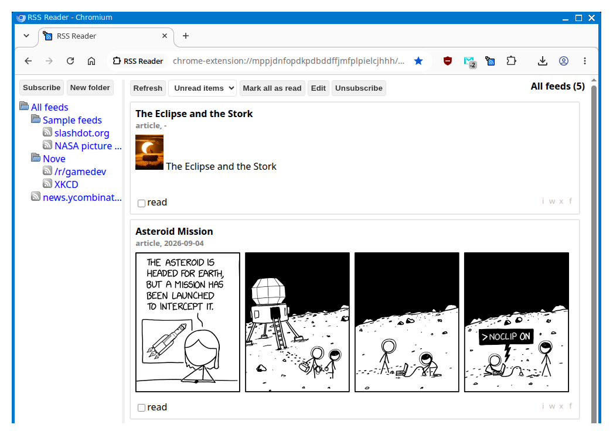

# What is it?

RSS Reader is extension for reading RSS and Atom news feeds.

# How to use it?

When you install RR there are already few feeds. You can add new feed by
selecting folder where you want to add it and then by clicking on
"Subscribe" button in top left corner. Then click on "Refresh" button 
to load new items. In settings you can export your feeds, and that's about it.

# Support

You can support development on [Patreon](https://www.patreon.com/DusanHalicky) or you can hire me via [Upwork](https://www.upwork.com/freelancers/~013b4c3d6e772fdb01)
